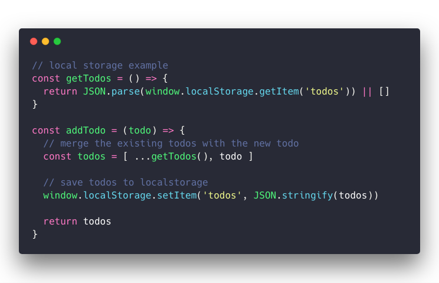
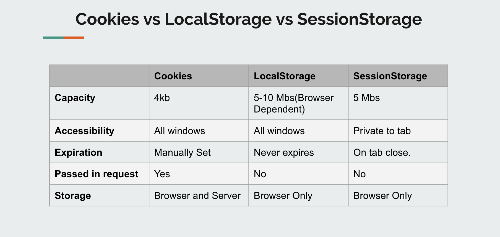
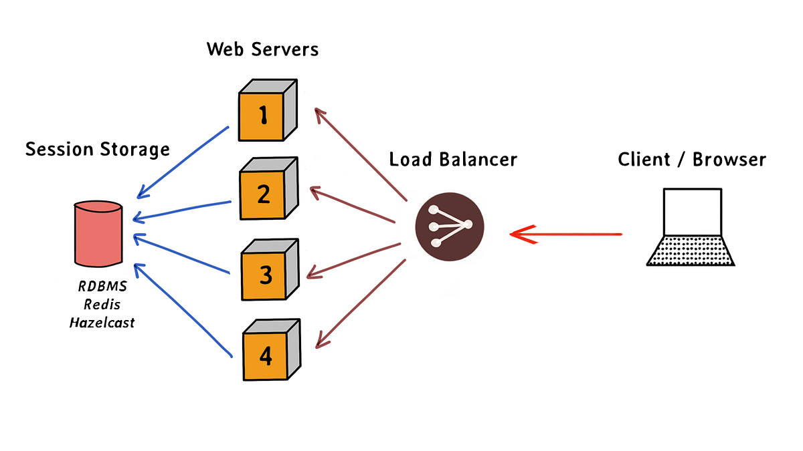

#  Local-Storage
localStorage, is a property of the window object in JavaScript that allows you to store key/value pairs in a web browser. The data stored in localStorage persist even after the browser is closed, making it a useful tool for saving user data on the client side. 

### Methods

* SetItem() 

> localStorage.setItem("myCat", "Tom");

* GetItem() 
> const cat = localStorage.getItem("myCat");

* removeItem() 
> localStorage.removeItem("myCat");

* clear()
>localStorage.clear();

#  Session-Storage
. In simple words, localStorage it is similar to sessionStorage, except that localStorage data has no expiration time, while sessionStorage data gets cleared when the page session ends — when the page is closed.

> Capacity - (4-10mbs)

#  Coockie

Cookies are data, stored in small text files, on your computer.

When a web server has sent a web page to a browser, the connection is shut down, and the server forgets everything about the user.

Cookies were invented to solve the problem "how to remember information about the user":

> When a user visits a web page, his/her name can be stored in a cookie.

> Next time the user visits the page, the cookie "remembers" his/her name.

"# Web-Storages" 
